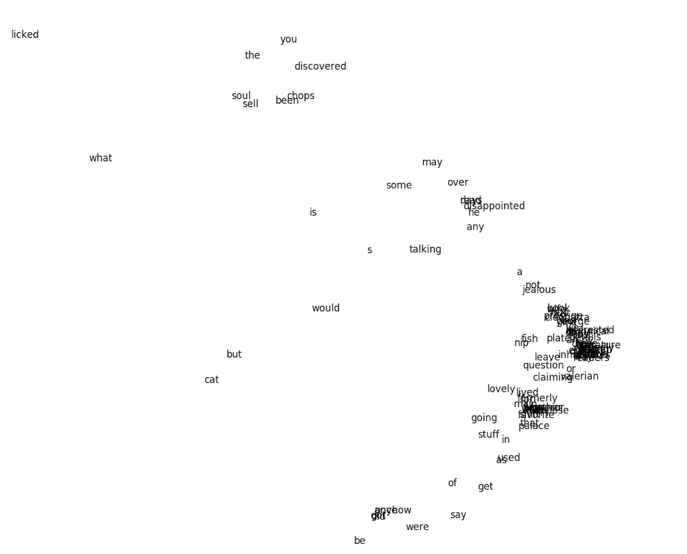

A repository of machine learning scraps.

## svdtext
```
$ python svdtext/svdtext.py svdtext/mehitabel_was_once_cleopatra

```

Singular value decomposition and plotting in a few lines of Python with [numpy](http://www.numpy.org/) and [matplotlib](https://matplotlib.org/), of the [Archy and Mehitabel](http://donmarquis.com/archy-and-mehitabel/) poem ["Mehitabel was once Cleopatra"](./svdtext/mehitabel_was_once_cleopatra).

