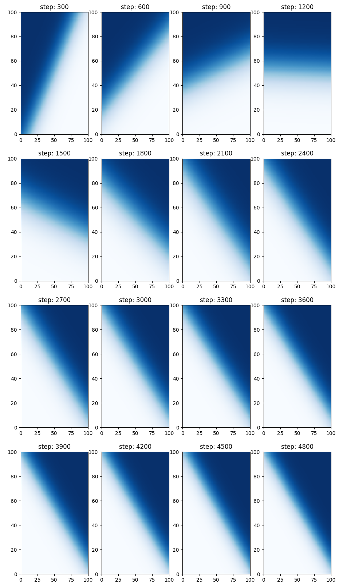

multi-instance learning
---
From:
http://mdenil.com/media/papers/2015-deep-multi-instance-learning.pdf

Multi-instance learning implemented in Tensorflow. Instead of being passed a label `y_i` for each corresponding input `x_i`, a label `l_I` is given for a corresponding set of inputs `{x}_I` and the individual labels `y_i` must be learned.

In this implementation a linear class boundary is learned by being passed random uniform subsets `{x}_I` as inputs and given the fraction interesecting the positive class as labels `l_I`. 

The loss function consists of two terms; one a similarity term on inputs and the other a group loss term.

### Run
`$ python3 mitr.py`

